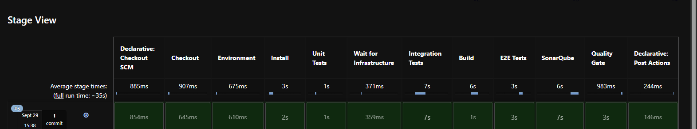
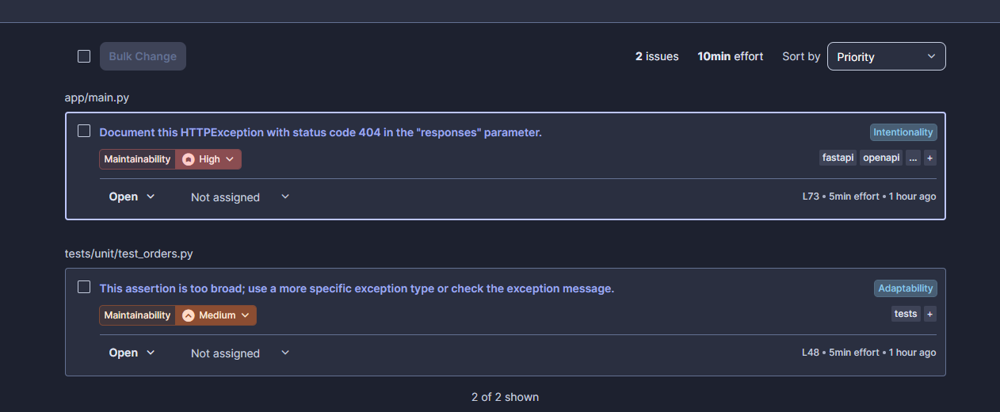
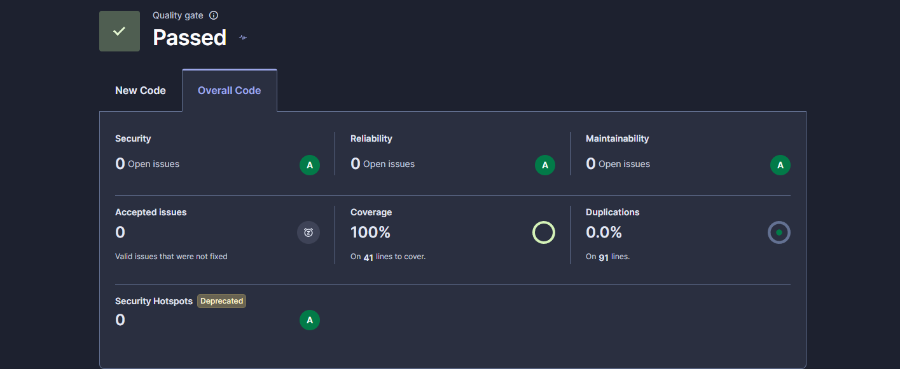
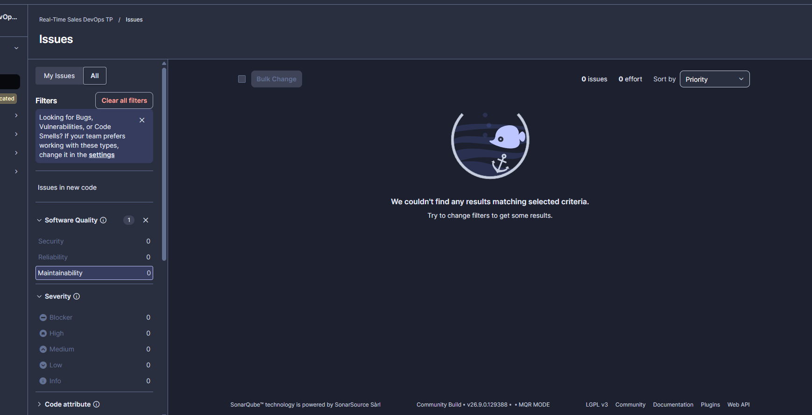

# Rapport Industrialisation de la pipeline Real-Time Sales

Projet : Real-Time Sales Analytics Pipeline (FastAPI, Kafka, PySpark, PostgreSQL)
Outils CI : Jenkins, SonarQube, pytest 

dépôt : https://github.com/TakeTheLBolt/tp1-pipeline

## 1. Architecture du projet

```text
Sales API (FastAPI) ──► Kafka (sales.orders) ──► PySpark Streaming ──► PostgreSQL (processed_orders)

GitHub ──► Jenkins ──► tests unitaires / intégration / build / E2E ──► SonarQube ──► Quality Gate
```

L'API valide une commande, calcule `total_amount = quantity × unit_price` et publie l'événement dans Kafka.
Spark lit le topic et écrit dans `processed_orders`. Jenkins et SonarQube sont dans le même
`docker-compose.yml`, sur le réseau Docker `data-platform`.

## 2. Stratégie de tests

Trois niveaux, du plus rapide au plus proche de la production :

| Niveau | Dossier | Services réels | Rôle |
|---|---|---|---|
| Unitaire | `tests/unit/` | non (Kafka mocké) | règles métier, validation, événement |
| Intégration | `tests/integration/` | oui (Docker) | deux liaisons : API→Kafka et Kafka→Spark→PostgreSQL |
| End-to-End | `tests/e2e/` | oui (Docker) | parcours complet API → PostgreSQL |

Les tests d'intégration et E2E sont activés par les variables `RUN_INTEGRATION_TESTS` et `RUN_E2E_TESTS`,
pour qu'un `pytest` lancé sans Docker n'échoue pas. Les attentes utilisent un **polling avec timeout**
(`tests/integration/helpers.py`, fonction `wait_until`), jamais un `sleep` fixe.

## 3. Tests unitaires

10 tests dans `tests/unit/test_orders.py`, couverture de `app/` : **100 %** (41 lignes).

- calcul du montant total (dont l'arrondi flottant : 3 × 0,1 = 0,3) ;
- quantité valide, nulle, négative, supérieure à 1000, non entière ;
- prix nul, négatif, trop élevé, non numérique ;
- identifiants client et produit trop courts ;
- format (`ORD-` + 10 caractères hexadécimaux) et unicité de l'identifiant de commande ;
- structure de l'événement (champs, valeurs, horodatage UTC, sérialisation JSON) ;
- configuration du producteur Kafka et endpoints (`/api/health`, `/api/products`, `POST /api/orders` avec
  Kafka mocké : 201, 404 produit inconnu, 422 charge invalide).

## 4. Tests d'intégration

- **Test A : API → Kafka** (`test_api_kafka.py`) : un `POST /api/orders` est envoyé, puis un consumer
  (groupe unique) relit `sales.orders` jusqu'à retrouver l'`order_id`, et les valeurs sont contrôlées.
- **Test B : Kafka → Spark → PostgreSQL** (`test_spark_postgres.py`) : un événement est publié directement
  dans Kafka, puis on attend (timeout 90 s) qu'il apparaisse dans `processed_orders` avec les bonnes valeurs.

## 5. Scénario End-to-End

`tests/e2e/test_sales_pipeline.py`, en Given / When / Then :

- **Given** l'infrastructure est démarrée (`/api/health` répond `UP`) ;
- **When** la commande `C100 / P001 / quantité 3 / prix 100` est envoyée à l'API ;
- **Then** la ligne apparaît dans PostgreSQL (attente avec timeout) avec `total_amount = 300`.

Un second test vérifie qu'une commande invalide (quantité négative) est rejetée avec un 422.

## 6. Pipeline Jenkins

`Jenkinsfile`, stages dans cet ordre : Checkout → Environment → Install (venv) → Unit Tests →
Wait for Infrastructure → Integration Tests → Build (`docker build` des images API et Spark) → E2E Tests →
SonarQube → Quality Gate.

La pipeline s'arrête au premier stage en échec. Les résultats JUnit sont publiés et `coverage.xml` est
archivé. Jenkins est sur le réseau Docker : les tests ciblent les services par leur nom
(`sales-api`, `kafka:29092`, `postgres`).



## 7. Configuration SonarQube

- Projet `real-time-sales-devops` (`sonar-project.properties`) : sources `app`, tests `tests`, rapport de
  couverture `coverage.xml`.
- `sonar-scanner` est installé dans l'image Jenkins. Le token est stocké dans les credentials Jenkins
  (`sonar-token`, type Secret text) et n'apparaît pas dans le dépôt.
- Le scanner cible `http://sonarqube:9000` depuis Jenkins.

## 8. Quality Gate

Le stage Quality Gate exécute `scripts/wait_quality_gate.py` : il attend la fin de l'analyse via l'API
SonarQube, lit le statut du Quality Gate, affiche chaque condition et **fait échouer la pipeline** si le
statut n'est pas `OK`. Sortie du build n°11 :

```text
Quality Gate : OK
  new_coverage                              OK   valeur=100.0 seuil=80
  new_duplicated_lines_density              OK   valeur=0.0   seuil=3
  new_software_quality_reliability_rating   OK
  new_software_quality_security_rating      OK
```

Limite : le gate appliqué contrôle les conditions sur le *nouveau code*, pas sur le code complet. De plus,
SonarQube ignore la condition de couverture quand le nouveau code compte trop peu de lignes : quelques
lignes non testées n'ont donc pas suffi à faire échouer le gate (voir §10).

## 9. Résultats obtenus

Analyse SonarQube (code complet) :

| | Première analyse | Après corrections |
|---|---|---|
| Bugs (Reliability) | 0 | 0 |
| Vulnérabilités (Security) | 0 | 0 |
| Code smells (Maintainability) | 2 | **0** |
| Couverture | 100 % | 100 % |
| Duplications | 0 % | 0 % |
| Quality Gate | Passed | Passed |

Tests : 10 unitaires, 3 d'intégration (dont le `test_health` du projet de départ), 2 E2E  tous verts.





**Détection d'une régression fonctionnelle (build n°7).** Le calcul du montant a été volontairement cassé
(`quantity + unit_price`). Jenkins a échoué au stage *Unit Tests* (4 tests en échec, par exemple
`assert 52.0 == 100.0`) et tous les stages suivants ont été sautés. Le calcul correct a ensuite été rétabli
et la pipeline est repassée au vert.

## 10. Problèmes rencontrés

- **Aucun plugin Jenkins installé** : `Pipeline`, `Git`, `JUnit` et `Sonar` ajoutés à l'image Jenkins.
- **Option `timestamps()` refusée** : le plugin Timestamper n'était pas installé, l'option a été retirée.
- **`python3 -m venv` et `docker compose` absents** du conteneur Jenkins : ajout de `python3-venv` et
  utilisation de `docker build` à la place de `docker compose build`.
- **`localhost` inaccessible depuis Jenkins** : les tests utilisent les noms de services Docker.
- **`kafka-python` 2.0.2 incompatible avec Python 3.13** (`kafka.vendor.six.moves`) : passage à 2.0.6.
- **Spark plantait au démarrage** (`UnknownTopicOrPartitionException`) car le topic n'existait pas encore :
  ajout d'un service `kafka-init` qui crée `sales.orders`, et `restart: on-failure`.
- **Spark plantait après un redémarrage** (clé primaire dupliquée, checkpoint perdu) : écriture rendue
  idempotente (`ON CONFLICT DO NOTHING`).
- **`docker compose down -v`** supprime aussi les volumes : SonarQube, Jenkins et PostgreSQL sont réinitialisés.
- **Quality Gate non déclenché par un peu de code non testé** : la condition de couverture est ignorée sous
  un certain nombre de nouvelles lignes, la dégradation de qualité n'a donc pas été démontrée.

## 11. Corrections réalisées

- SonarQube, `app/main.py` : le code 404 de `POST /api/orders` est documenté dans `responses`.
- SonarQube, `tests/unit/test_orders.py` : `pytest.raises(Exception)` remplacé par `pytest.raises(ValidationError)`.
- Infrastructure : service `kafka-init`, redémarrage automatique de Spark, écriture idempotente dans PostgreSQL.
- CI : image Jenkins complétée, Jenkinsfile industrialisé, contrôle du Quality Gate scripté.
- Des commits de démonstration (« TEST REGRESSION ») figurent dans l'historique ; le code non testé qu'ils
  avaient ajouté a été supprimé par le commit « Nettoyage ».

## Question de synthèse

Comment garantir automatiquement qu'une modification ne dégrade ni le fonctionnement ni la qualité ?
Chaque `push` peut déclencher Jenkins, qui enchaîne des contrôles de plus en plus larges : tests unitaires
(règles métier, en quelques secondes), tests d'intégration (les composants réels communiquent), build des
images, test E2E (le parcours complet), puis SonarQube et le Quality Gate (bugs, vulnérabilités,
duplications, couverture). Un échec à n'importe quel stage arrête la pipeline, comme l'a montré le build
n°7. Le dépôt garde l'historique, et la Pull Request permet de relire avant intégration.
